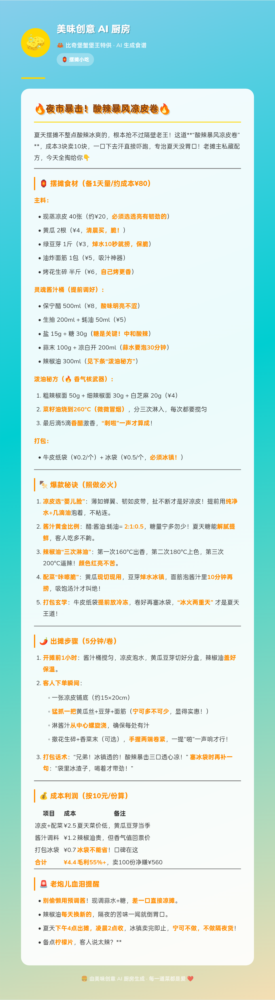

# 美味创意AI厨房 🍔

**🌊 在线体验：** https://game.bikini-bottom.store/

一个由 **海绵宝宝 × 蟹老板 × 派大星 × 章鱼哥** 联合打造的 AI 食谱生成器！



## 🎯 功能

- 🧽 **6种烹饪模式**：普通 / 米其林 / 暗黑料理 / 治愈系 / 蹲门模式 / 摆摊小吃
- 🔥 **AI驱动**：调用 OpenRouter 的 Step-3.5-Flash 模型
- 🌊 **比奇堡主题**：海底世界风格界面，气泡背景动画
- ⚡ **流式输出**：实时显示生成的食谱
- 🔐 **安全架构**：后端代理隐藏 API Key
- 📜 **历史记录**：本地永久保存食谱，支持收藏、恢复、导出/导入
- 🖼️ **分享图片**：一键生成比奇堡风格食谱分享图
- 🎁 **食材盲盒**：每生成3道菜获得1张卡券，可抽取稀有食材或限定食谱
- ✨ **高级分享图**：5种风格（米其林/暗黑/治愈/摆摊/经典），支持下载和分享

## 🚀 快速开始

### 本地开发

```bash
# 1. 克隆仓库
git clone https://github.com/YOUR_USERNAME/ai-kitchen.git
cd ai-kitchen

# 2. 安装依赖（可选，本项目无依赖）
# 无需安装

# 3. 本地测试前端
open index.html
# 或用 Python 启动本地服务器
python3 -m http.server 8000
```

### 部署到 Vercel

```bash
# 1. 安装 Vercel CLI
npm i -g vercel

# 2. 部署
vercel

# 3. 设置环境变量
# 在 Vercel 控制面板添加：
# OPENROUTER_API_KEY = sk-or-v1-xxx...
```

## 📁 项目结构

```
ai-kitchen/
├── index.html              # 前端页面（纯 HTML 结构，177 行）
├── assets/
│   └── style.css           # 全局样式（主题色、组件、响应式）
├── modules/
│   ├── modes.js            # 烹饪模式配置（6种模式 + prompt 模板）
│   ├── utils.js            # 通用工具（气泡、Toast、错误提示、HTML 转义）
│   ├── history.js          # 历史记录（存储/渲染/收藏/导出导入）
│   ├── share.js            # 图片分享（html2canvas 截图）
│   └── cooking.js          # 主烹饪逻辑（流式渲染 + API 调用）
├── api/
│   └── chat.js             # Serverless 后端函数（代理 OpenRouter）
├── screenshot.png          # 产品截图
├── vercel.json             # Vercel 配置
└── README.md               # 本文件
```

## 🧱 开发规范

**新增功能时遵循以下原则：**

- 加新烹饪模式 → 只改 `modules/modes.js`
- 改历史记录逻辑 → 只改 `modules/history.js`
- 加新功能模块 → 新建 `modules/xxx.js`，在 `index.html` 末尾加一行 `<script src="./modules/xxx.js">` 即可
- 改样式 → 只改 `assets/style.css`，按注释分区找对应模块
- **不要**往 `index.html` 的 `<script>` 块里直接写业务逻辑
- Phase 2 云端同步 → 只替换 `history.js` 里的 `loadHistory / saveHistory` 存储层，UI 逻辑不动

## 🔐 安全特性

- ✅ **API Key 隐藏**：Key 只存在于后端，前端无法访问
- ✅ **CORS 保护**：只允许来自指定域名的请求
- ✅ **输入验证**：防止注入攻击和滥用
- ✅ **请求限制**：限制消息长度和模型选择
- ✅ **错误处理**：安全的错误提示，不泄露敏感信息

## 🛠️ 环境变量

部署时需要设置：

```
OPENROUTER_API_KEY=sk-or-v1-xxx...
```

获取方式：
1. 去 https://openrouter.ai 注册
2. 创建 API Key
3. 在 Key 设置中添加 **Allowed Websites**: `*.vercel.app`

## 📝 使用示例

### 前端调用

```javascript
const response = await fetch('/api/chat', {
  method: 'POST',
  headers: { 'Content-Type': 'application/json' },
  body: JSON.stringify({
    model: 'stepfun/step-3.5-flash:free',
    messages: [
      { role: 'system', content: '你是一位热情的厨师...' },
      { role: 'user', content: '我想吃暖汤面' }
    ],
    stream: true
  })
});
```

## 🎨 界面特色

- 🌊 海底世界渐变背景
- 🧽 会跳动的海绵宝宝 Logo
- 🫧 浮动气泡动画
- 🍳 加载中的平底锅翻转动画
- 📱 完全响应式设计

## 👥 团队成员

| 角色 | 职责 |
|------|------|
| 🧽 海绵宝宝 | 前端开发 |
| 🐙 章鱼哥 | UI设计 + 安全审计 |
| ⭐ 派大星 | 测试 + 反馈 |
| 🦀 蟹老板 | 后端 + 项目管理 |

## 📄 许可证

MIT License - 自由使用和修改

## 🤝 贡献

欢迎提交 Issue 和 Pull Request！

## 🗺️ 路线图

- [x] Phase 1 — 本地历史记录（localStorage）
- [x] Phase 2 — 食材盲盒系统 + 高级分享图
- [ ] Phase 3 — 微信支付接入 + 云端同步
- [ ] Phase 4 — 微信小程序
- [ ] Phase 5 — 社区 UGC + 排行榜

---

## 📖 详细文档

- **[盲盒系统 + 高级分享图指南](./GACHA_GUIDE.md)** — 完整的功能说明和商业化建议

---

**Made with 🧡 by 蟹堡王 AI 团队**

*每一道菜都是爱 ❤️*
